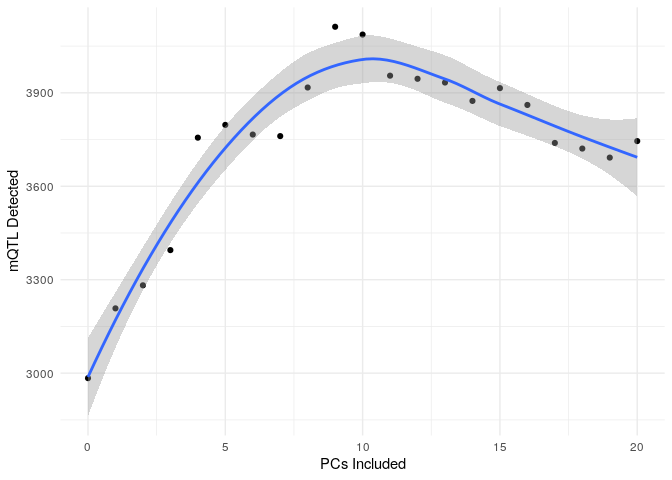

# Objectives

1.  Basics of molecular quantitative trait locus (molQTL) analysis
2.  Running cis-methylation QTL analysis with the `matrixEQTL` package

# Quantitative trait loci (QTL) basics

Quantitative trait loci are "mapped" by computing the association between SNP genotype and a quantitative trait likeDNA methylation (DNAm), gene expression, or some other epigenetic mark. Analysis pipelines for computing these "molecular" QTL, or molQTL, can be complex, and fully understanding each of the steps in these pipelines in detail can be daunting. In this tutorial, I break down molQTL analysis into general steps that are based on what is used by the Genotype-Tissue Expression (GTEx) consortium. GTEx has set the standard for computing expression QTL (eQTL), and as of writing they have computed mQTL across 8 tissues [@thegtexconsortiumGTExConsortiumAtlas2020; @olivaDNAMethylationQTL2023]. Their approach is summarized in the figure below: 

For the purpose of this tutorial, we will assume that the following has been done:

-   Quality control of Genotyping and molecular trait data (i.e., up until normalization)
-   Population structure estimation via computing genotype principal components[@sulPopulationStructureGenetic2018; @pricePrincipalComponentsAnalysis2006; @elhaikPrincipalComponentAnalyses2022]

# Example: mQTL analysis in the RICHS study

We will be using data from the Rhode Island Child Health Study (RICHS), which contains 450K Array Data for DNAm and SNP genotype for roughly $N=136$ placental samples. The original data can be requested from [GEO](https://www.ncbi.nlm.nih.gov/geo/query/acc.cgi?acc=GSE75248) and [dbGaP](https://www.ncbi.nlm.nih.gov/projects/gap/cgi-bin/study.cgi?study_id=phs001586.v1.p1). \## Formatting data for `MatrixEQTL`

`MatrixEQTL` is a package that efficiently runs linear regression through the use of large matrix operations.[@andreya.shabalinMatrixEQTLUltra2012] There are several alternative molQTL-mapping software that offer their own advantages such as fast permutation procedure for estimating significance[@ongenFastEfficientQTL2016; @delaneauCompleteToolSet2017] or alternatives to linear models.[@leeGenomeWideExpressionQuantitative2018]

`MatrixEQTL` is relatively simple to run, and as it reports results from simple linear regression it is straightforward to interpret. The required formats are shown in their [online documentation](https://www.bios.unc.edu/research/genomic_software/Matrix_eQTL/runit.html#own). In brief, we will need the following tab or whitespace-delimited files:

-   Covariates: the first column being the ID of each covariate, with subsequent columns being each sample

-   Genotypes: The first column being the rsID or SNP-identifier, with subsequent columns being each sample

-   Quantitative trait: The first column being a "gene" id or molecular trait identifier, with subsequent columns being each sample

-   Position files:

    -   Genotypes: SNP identifier, chromosome, position

    -   Molecular trait: gene/trait identifier, chromosome, start, end

### Required packages

```{r setup}
knitr::opts_chunk$set(eval = FALSE) # Change to TRUE if you want all chunks to be run
```

```{r,echo=FALSE}
# To install, uncomment lines below
# install.packages("tidyverse")
# install.packages("data.table")
# install.packages("MatrixEQTL")
# require(BiocManager)
# BiocManager::install("minfi")
# BiocManager::install("IlluminaHumanMethylation450kanno.ilmn12.hg19")
library(tidyverse) 
library(data.table) # Allows for fast reading and writing of text files
library(MatrixEQTL)
# Bioconductor packages
library(minfi)
library(IlluminaHumanMethylation450kanno.ilmn12.hg19) 
```

### Loading in required data

molQTL data are split into each set of measurements with only partially overlapping samples. This is for a variety of reasons. In the case of RICHS, it is because the DNAm data was first used in a separate publication consisting of more subjects,[@paquetteRegionsVariableDNA2016a] with the genotpying data published separately as part of an eQTL analysis. [@pengExpressionQuantitativeTrait2017a; @pengGeneticRegulationPlacental2018]

This means that we need to harmonize IDs across both the DNAm and genotyping data **and** their respective metadata, which makes it easier to ensure that samples are in the same order prior to running `MatrixEQTL`. Other software may do this reordering automatically based on IDs, but it is a good idea to match he order of samples based on a shared ID just in case this is not true. In the case of RICHS, we required a file mapping IDs from GEO, where we retrieved DNAm, to those on dbGaP.

### Assigning a common ID to DNAm and genotyping data and metadata

```{r}
methy_annot <- as.data.table(
  getAnnotation(
    IlluminaHumanMethylation450kanno.ilmn12.hg19 # Information on 450k probes
  )
)
richs_ancestry <- fread("data/population-structure.eigenvec") #Genotype PCs 
pheno <- fread("data/phenotypes.txt") # phenotype/covariate information
sample_multi <- fread("data/genotype-sample-ids.txt")
fam <- read.delim("data/raw-data.fam",header=FALSE,sep="") # RICHS '.fam' file
mapping <- fread("data/RICHS_dbgap_GEO_subject_sample_mapping.csv")

# Create single metadata table with all non-hidden covariates and sample labels
combined_meta <- pheno %>%
    left_join(
        sample_multi
    )%>% filter(SAMPLE_USE == "Array_SNP")
richs_meta <- combined_meta
richs_meta$IID <- richs_meta$SAMPLE_ID
richs_meta_methy <- fread("data/methylation-metadata.csv") %>% 
  inner_join(mapping,by=c("sample"= "GSM_SampleID"))
richs_meta <- richs_meta %>%
  right_join(richs_ancestry,by=c("IID"="V2")) %>%
  right_join(richs_meta_methy,by="SAMPLE_ID") %>%
  filter(SAMPLE_ID %in% richs_ancestry$V2)

methylation <- fread("data/processed_DNAm_RICHS_functional_norm.txt.gz") 
genotype <- fread("data/RICHS-genotype.traw.gz") # plink tab-delimited genotype 

# Part of genotype id before '_' character was redundant:
colnames(genotype) <- gsub(".*_","",colnames(genotype)) 
```

### Match Samples

```{r}
# Filter to subjects with both genotype and DNAm
richs_meta <- richs_meta[
  IID %in% colnames(genotype) & geo_accession %in% colnames(methylation)
]
gen_vars <- c(colnames(genotype)[1:6],richs_meta$IID)
to_delete <- colnames(genotype)[!colnames(genotype)%in% gen_vars]
genotype[,c(to_delete):=NULL]

# match sample order
setcolorder(genotype,gen_vars)
methy_vars <- c("cpg",richs_meta$geo_accession)
methylation <- methylation[,methy_vars,with=FALSE]

# Check if samples match
all(colnames(methylation)[-c(1)] == richs_meta$geo_accession)
all(colnames(genotype)[-c(1:6)] == richs_meta$IID)
```

## Preparing covariates for mQTL analysis

### Hidden Covariates

In addition to known variation due to measured covariates, we also account for "hidden" covariates in whichever quantitative trait we are measuring. "Hidden" covariates are any possible variable that affects global DNAm that could also explain the association between a single SNP and a quantitative trait.[@mostafaviNormalizingRNASequencingData2013; @zhouPCAOutperformsPopular2022] This is computed a number of methods, most of which are closely tied to principal components analysis. For example, GTEx uses a variable number of PEER factors computed from gene expression to account for hidden variation,[@thegtexconsortiumGTExConsortiumAtlas2020; @stegleUsingProbabilisticEstimation2012] but there are several others including SVA, HCP, or PCA alone.[@mostafaviNormalizingRNASequencingData2013; @zhouPCAOutperformsPopular2022; @leek2007a; @leekSvaPackageRemoving2012]

On the other hand, PCA itself is often easier to apply, and performs as well as or better than the methods listed above in reducing false positives, and in improving our power to detect molQTL.[@zhouPCAOutperformsPopular2022] We compute the optimal number of DNAm PCs to include using the "elbow" method. First, we take a subset of SNPs, in this example those on chromosome 21, and compute mQTL accounting for an increasing number of principal components. The optimal number of PCs to include is when we stop detecting more mQTL with each successive PC.

#### Example: PCA in RICHS DNAm

In some cases, you may want to regress out or account for covariates affecting DNAm prior to computing PCs. This is conceptually similar to what is done with methods like PEER or HCP, or even ComBat, which is a commonly used method in processing DNAm for epigenome-wide association studies.[@stegleUsingProbabilisticEstimation2012; @mostafaviNormalizingRNASequencingData2013; @leekSvaPackageRemoving2012] Below, I included the option of performing this procedure before computing DNAm PCs, but note that it is not necessary and that you should have a justification for doing so when writing up your analysis.

In this module, we will compute 20 DNAm PCs using methylation from all autosomes and the X chromosome (plan to include X-chromosome analysis in our project).

```{r}
REMOVE_COVARIATES <- FALSE # Change to TRUE to regress out covariates before PCA
covars <- richs_meta %>% as.data.frame() %>%
                dplyr::select(
                    age,
                    V3,
                    V4,
                    V5,
                    V6,
                    V7,
                    sex
                ) %>%
                mutate(Sex= as.numeric(sex =="M"))%>%
                dplyr::select(-sex) %>%
                as.data.frame()
if(REMOVE_COVARIATES == TRUE){
  matrix_methy <- as.matrix(
    t(
      methylation[!cpg %in% methy_annot[chr %in% c("chrX","chrY")]$Name ,-c(1)]
    )
  )
  residual <- residuals(lm(matrix_methy ~ ., data=covars))
  methy_PC <- prcomp(residual, center=T,rank.= 20)
}else{
  methy_PC <- prcomp(as.matrix(t(methylation[,-c(1)])), center=T,rank.= 20)
}

```

### Formatting `MatrixEQTL` files

Since we first need to find the proper number of DNAm PCs to include in our model, we need to generate a covariate file for each additional PC we're adding, We need to generate genotype and methylation files for just chromosome 21 so that we have a subset to test these varying number of PCs.

#### Covariate files

Our model for this mQTL analysis is:

$$ DNAm_j \sim (intercept)+SNP_i + \text{Sex} + \text{Gestational Age} +
\text{Genotype PCs}_{1\dots 5} + \text{DNAm PCs}_{0\dots k}$$

In the code below, we place sex last since MatrixEQTL has an option to include an interaction term for the last variable. `MatrixEQTL` adds in the intercept term automatically:

```{r}
fmt <- "data/mQTL_covar_%d_methy_PC.txt"
for(i in 0:20){
    if (i==1){
        tmp <- t(cbind(PC1=methy_PC$x[,1:i],richs_meta %>% as.data.frame() %>%
                dplyr::select(
                    age,
                    V3,# V3-V7 are the first 5 Genotyping PCs
                    V4,
                    V5,
                    V6,
                    V7,
                    sex
                )) %>%
                mutate(Sex= as.numeric(sex =="M"))%>%
                dplyr::select(-sex)) %>%
                as.data.frame()

    }else if (i==0){
          tmp <- t(cbind(richs_meta %>% as.data.frame() %>%
               dplyr::select(
                    age,
                    V3,
                    V4,
                    V5,
                    V6,
                    V7,
                    sex
                )) %>%
                mutate(Sex= as.numeric(sex =="M"))%>%
                dplyr::select(-sex)) %>%
                as.data.frame()
    }else{
        tmp <- t(cbind(methy_PC$x[,1:i],
                richs_meta %>% as.data.frame() %>%
                dplyr::select(
                    age,
                    V3,
                    V4,
                    V5,
                    V6,
                    V7,
                    sex
                )) %>%
                mutate(Sex= as.numeric(sex =="M"))%>%
                dplyr::select(-sex)) %>%

                as.data.frame()

    }
  colnames(tmp) <- richs_meta$IID
  fwrite(
    tmp %>% rownames_to_column(var="id"),
    file=sprintf(fmt,i),
    sep="\t",
    quote=F
  )
}
```

#### Writing out genotype and methylation data

```{r}
# SNP position files
fwrite(genotype[,.(SNP,CHR=paste0("chr",CHR),POS)],
       "data/snp_pos.txt",
       sep="\t",
       quote=F
)
fwrite(
  genotype[CHR==21,.(SNP,CHR=paste0("chr",CHR),POS)],
  "data/snp_pos_chr21.txt",
  sep = "\t",
  quote=F
)

# Methylation position files
fwrite(
  methy_annot[Name %in% methylation$cpg,.(geneid=Name,chr,s1=pos,s2=pos)],
  "data/probe_pos.txt",
  sep = "\t",
  quote=F
)
fwrite(
  methy_annot[
    Name %in% methylation$cpg & chr=="chr21",
    .(geneid=Name, chr,s1=pos,s2=pos)
  ],
  "data/probe_pos_chr21.txt",
  sep = "\t",
  quote=F
)

# Genotype
geno_vars <- colnames(genotype)[c(1,3:6)]
genotype[,c(geno_vars):=NULL]
fwrite(genotype,"data/all_imputed_matrixeQTL.txt",sep = "\t",quote = F)
snp_pos <- fread("data/snp_pos.txt")
fwrite(
  genotype[SNP %in% snp_pos[CHR=="chr21"]$SNP],
  "data/all_imputed_matrixeQTL_chr21.txt",
  sep = "\t",
  quote = F
)

# Methylation
fwrite(methylation,"data/methylation_matrixeQTL.txt",sep="\t",quote=F)
chr21_cpg <- methy_annot[Name %in% methylation$cpg & chr == "chr21",]$Name
fwrite(
  methylation[cpg %in% chr21_cpg],
  "data/methylation_matrixeQTL_chr21.txt",
  sep="\t",
  quote=F
)
```

#### Selecting the optimal number of PCs

`MatrixEQTL` can be run to compute the association between all SNPs within 75 kb of a CpG site[@smithMethylationQuantitativeTrait2014; @doMechanismsDiseaseAssociations2016; @shiCharacterizingGeneticBasis2014; @zhangLinkingGeneticArchitecture2014] using the R script [`run_cis_mQTL_75k.R`](scripts/run_cis_mQTL_75k.R):

```{r, code=readLines('scripts/run_cis_mqtl_75k.R')}
```

By default, the above script will print all pairwise associations. If you are computing a large number of mQTL, for example using the EPIC array, you may want to restrict the output to only include associations with $p < 0.25$, which can be done by setting `pv_out_threshold <- 0.25`.

For our PC experiment, we will use an array job to compute mQTL on chromosome 21 accounting for 0-20 DNAm PCs, running each set of covariates in parallel with the chromosome 21 data we saved before. See [run_mQTL_PCs.pbs](scripts/run_mQTL_PCs.pbs):

```{bash, code=readLines('scripts/run_mQTL_PCs.pbs')}
```

Pay attention to the location of your data, whether your account information is correct in the #PBS header, and whether your current R setup requires some adjustments such that your job can run the `Rscript` command with the `MatrixEQTL` package installed.

This script is submitted as follows:

```{bash}
qsub scripts/run_mQTL_PCs.pbs
```

The output of the above script should be a list of mQTL files listing PCs from 0-20. We can plot the number of associations significant at a Bonferroni corrected $p < 0.05$ per each additional PC in our model:

```{r}
fmt <- "data/cis_all_impute_mQTL_results_%d_methy_PC_chr21.txt"
chr21_res <- lapply(
  0:20,
  function(i){
    tmp <- fread(sprintf(fmt,i))
    nrow(tmp[`p-value` < (0.05/ .N)])
  }
)
to_plot <- data.frame(PC=0:20,hits=unlist(chr21_res))
ggplot(to_plot,aes(PC,hits)) +
  geom_point() +
  geom_smooth() +
  labs(x="PCs Included",y="mQTL Detected") +
  theme_minimal()
```

 From above it looks like after 9 PCs, we stop improving our ability to detect mQTL. In larger sample sizes (e.g., $N > 250$), we often observe that the number of hits levels off at a certain number of PCs included in the model.

# Running the final mQTL analysis

We can modify the script we used to run `MatrixEQTL` for different numbers of PCs to simply run our entire cis-mQTL analysis for one set of covariates. See [run_mQTL_all.pbs](scripts/run_mQTL_all.pbs):

```{bash, code=readLines('scripts/run_mQTL_all.pbs')}
```

# Additional notes

## Checking if your results are valid

After running mQTL analysis, it is a good idea to take note of how many significant associations you found and how it compares to other similar studies. A common metric for replication is the $\pi_1$ statistic, which measures the proportion of your associations that are non-null in another study.[@storeyStatisticalSignificanceGenomewide2003; @storeyQvalueQvalueEstimation2017] Mashr is an alternative to $\pi_1$ which runs a permutation procedure to get a less biased estimate of replication.[@urbutFlexibleStatisticalMethods2019]\
\
It's also imporant to check for inflation of summary statistics. In a *cis*-mQTL analysis, we expect to see some inflation since we CpG sites are enriched for nearby associations with SNPs. In other words, the likelihood of observing an mQTL increases the closer you get to a particular CpG site. However, inflation at large pvalues (0.01-1) should be absent in the case of proper controlling for confounding. [@mcraeIdentification550002018; @gauntSystematicIdentificationGenetic2016; @huanGenomewideIdentificationDNA2019]\

## Reporting results

Although `MatrixEQTL` provides a q-value (False-discovery rate, or FDR, adjusted p-value), which can be used to call significant molQTL, there are a few approaches to calling significance in molQTL analysis. The approach taken by GTEX in eQTL analysis is a two-step procedure in which significant eQTL are called for each gene at an FDR threshold, and then evaluate remaining eQTL at a Bonferroni-corrected threshold. [@thegtexconsortiumGTExConsortiumAtlas2020] This procedure is in part justified by mentioning the independence of eQTL for a single gene vs. between different genes.\
\
The procedure for reporting mQTL, and increasingly all molQTL and other eQTL, is becoming more complicated. In the case of mQTL, there is increasing emphasis on reporting "independent" associations. In some cases, this independence refers to the actual independence between SNPs associated with each CpG site, as measured via linkage-disequilibrium. In this case, we could report mQTL using a pruning procedure, such as one implemented in [PLINK](https://www.cog-genomics.org/plink/). [@changSecondgenerationPLINKRising2015; @hannonLeveragingDNAMethylationQuantitativeTrait2018; @gauntSystematicIdentificationGenetic2016] Alternatively, we can think about whether associations are independent using a step-wise regression procedure, where we see if an mQTL remains when accounting for associations with other nearby SNPs. This procedure is available in [mt-CoJo](https://yanglab.westlake.edu.cn/software/gcta/#mtCOJO), and is used in some fairly influential mQTL studies.[@yangConditionalJointMultipleSNP2012; @minGenomicPhenotypicInsights2021; @olivaDNAMethylationQTL2023]

A simple, stringent method for calling mQTL is to simply use a Bonferroni-corrected threshold, calling significance at an $\alpha < 0.05$, which corresponds to having a nominal $p < \frac{\alpha}{N}$, where N is the number of SNP-CpG pairs tested in your analysis. [@ngXQTLMapIntegrates2017]

# References
