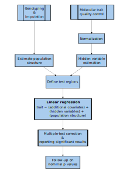

# Objectives
1. Basics of molecular quantitative trait locus (molQTL) analysis
1. Running cis-methylation QTL analysis with the `matrixEQTL` package
1. Post-hoc analyses involving molQTL and GWAS summary statistics
# Quantitative trait loci (QTL) basics
Quantitative trait loci are "mapped" by computing the association between SNP genotype and a quantitative trait like DNA methylation (DNAm), gene expression, or some other epigenetic mark. Analysis pipelines for computing these "molecular" QTL, or molQTL, can be complex, and fully understanding each of the steps in these pipelines in detail can be daunting. In this tutorial, I break down molQTL analysis into general steps based on what is used in by the Genotype-Tissue Expression (GTEx) consortium. GTEx has more or less set the standard for computing expression QTL (eQTL), and as of writing they have recently computed mQTL across 8 tissues [@thegtexconsortiumGTExConsortiumAtlas2020;@olivaDNAMethylationQTL2023]. Their approach to simply mapping molQTL is summarized in the figure below:

For the purpose of this tutorial, we will assume that the following has been done:
- Quality control of Genotyping and molecular trait data (i.e., up until normalization)
- Population structure estimation via computing genotype principal components @TODOCITE 

# Preparing covariates for mQTL analysis
The Rhode Island Children's Health Study (RICHS) 

## Required packages
```{r}
library(tidyverse) # install.packages("tidyverse")
library(data.table) # install.packages("data.table")
# Bioconductor packages
require(BiocManager)
library(minfi) # BiocManager::install("minfi")
library(IlluminaHumanMethylation450kanno.ilmn12.hg19) # BiocManager::install("IlluminaHumanMethylation450kanno.ilmn12.hg19")
```
## Formatting data for `matrixEQTL`
`matrixEQTL` is a package that efficiently runs linear regression through the use of large matrix operations.[@andreya.shabalinMatrixEQTLUltra2012] There are several alternative molQTL-mapping software that offer their own advantages such as fast permutation procedure for estimating significance[@ongenFastEfficientQTL2016;@delaneauCompleteToolSet2017] or alternatives to linear models.[@leeGenomeWideExpressionQuantitative2018] 

`matrixEQTL` is relatively simple to run, and as it reports results from simple linear regression it is straightforward to interpret. The required formats are shown in their [online documentation](https://www.bios.unc.edu/research/genomic_software/Matrix_eQTL/runit.html#own). In brief, we will need the following tab or whitespace-delimited files:
- covariates: the first column being the ID of each covariate, with subsequent columns being each sample
- Genotypes: The first column being the rsID or SNP-identifier, with subsequent columns being each sample
- Quantitative trait: The first column being a "gene" id or molecular trait identifier, with subsequent columns being each sample
- position files
  - Genotypes: SNP identifier, chromosome, position
  - Molecular trait: gene/trait identifier, chromosome, start, end

### Loading in required data
```{r}
methy_annot <- as.data.table(getAnnotation(IlluminaHumanMethylation450kanno.ilmn12.hg19))
richs_ancestry <- fread("../RICHS_genotyping/phg001102.v1.RICHS.genotype-calls-matrixfmt.MEGA_Consortium.c1.GRU/raw_data.geno.maf.mind.sex_check.het_filter.ibd_filter.eigenvec")
subject_pheno <- fread("/scratch/st-dennisjk-1/wcasazza/RICHS_genotyping/RICHS_Subject_phenotypes.GRU.txt")
sample_multi <- fread("/scratch/st-dennisjk-1/wcasazza/RICHS_genotyping/RICHS_Sample.MULTI.txt")
fam <- read.delim("/scratch/st-dennisjk-1/wcasazza/RICHS_genotyping/phg001102.v1.RICHS.genotype-calls-matrixfmt.MEGA_Consortium.c1.GRU/plink_for_dbgap.fam",header=FALSE,sep="")
mapping <- fread("RICHS_dbgap_GEO_subject_sample_mapping.csv")
combined_meta <- subject_pheno %>%
    left_join(
        sample_multi
    )%>% filter(SAMPLE_USE == "Array_SNP")
richs_meta <- combined_meta
richs_meta$IID <- richs_meta$SAMPLE_ID
richs_meta_methy <- fread("../RICHS_DNAm/metadata.csv") %>% inner_join(mapping,by=c("sample"= "GSM_SampleID"))
richs_meta <- richs_meta %>% right_join(richs_ancestry,by=c("IID"="V2")) %>% right_join(richs_meta_methy,by="SAMPLE_ID") %>% filter(SAMPLE_ID %in% richs_ancestry$V2)
betas_sub <- fread("processed_DNAm_RICHS_functional_norm.txt")
genotype <- fread("../RICHS_genotyping/phg001102.v1.RICHS.genotype-calls-matrixfmt.MEGA_Consortium.c1.GRU/raw_data.imputed.r2_30.maf_mismatch.traw")
```

## Match Samples
```{r}
colnames(genotype) <- gsub(".*_","",colnames(genotype))
richs_meta <- richs_meta[IID %in% colnames(genotype) & sample %in% colnames(betas_sub)]
gen_vars <- c(colnames(genotype)[1:6],richs_meta$IID)
to_delete <- colnames(genotype)[!colnames(genotype)%in% gen_vars]
genotype[,c(to_delete):=NULL]
setcolorder(genotype,gen_vars)
methy_vars <- c("cpg",richs_meta$sample)
betas_sub <- betas_sub[,methy_vars,with=FALSE]

```
```{r}
all(colnames(betas_sub)[-c(1)] == richs_meta$sample)
all(colnames(genotype)[-c(1:6)] == richs_meta$IID)
```
## Compute PCs
```{r}
covars <- richs_meta %>% as.data.frame() %>%
                dplyr::select(
                    age,
                    V3,
                    V4,
                    V5,
                    V6,
                    V7,
                    sex
                ) %>%
                mutate(Sex= as.numeric(sex =="M"))%>%
                dplyr::select(-sex) %>%
                as.data.frame()
residual <- residuals(lm(as.matrix(t(betas_sub[!cpg %in% methy_annot[chr %in% c("chrX","chrY")]$Name ,-c(1)]))~., data=covars))
methy_PC <- prcomp(residual, center=T,rank.= 20)
```


## Write data


```{r}
#SNP POS
fwrite(genotype[,.(SNP,CHR=paste0("chr",CHR),POS)],"matrix_eqtl_data/snp_pos.txt",sep="\t", quote=F)
#SNP POS
fwrite(genotype[CHR==21,.(SNP,CHR=paste0("chr",CHR),POS)],"matrix_eqtl_data/snp_pos_chr21.txt",sep = "\t", quote=F)
#SNPs
geno_vars <- colnames(genotype)[c(1,3:6)]
genotype[,c(geno_vars):=NULL]
fwrite(genotype,"matrix_eqtl_data/all_imputed_matrixeQTL.txt",sep = "\t",quote = F)
#Methy POS
fwrite(methy_annot[Name %in% betas_sub$cpg,.(geneid=Name,chr,s1=pos,s2=pos)], "matrix_eqtl_data/probe_pos.txt",sep = "\t",quote=F)
#methy
fwrite(betas_sub,"matrix_eqtl_data/methylation_matrixeQTL.txt",sep="\t",quote=F)


#SNPs
snp_pos <- fread("matrix_eqtl_data/snp_pos.txt")
fwrite(genotype[SNP %in% snp_pos[CHR=="chr21"]$SNP],"matrix_eqtl_data/all_imputed_matrixeQTL_chr21.txt", sep = "\t", quote = F)
#Methy POS
fwrite(methy_annot[Name %in% betas_sub$cpg & chr=="chr21",.(geneid=Name, chr,s1=pos,s2=pos)], "matrix_eqtl_data/probe_pos_chr1.txt", sep = "\t", quote=F)
chr1_cpg <- methy_annot[Name %in% betas_sub$cpg & chr == "chr21",]$Name
#methy
fwrite(betas_sub[cpg %in% chr1_cpg],"matrix_eqtl_data/methylation_matrixeQTL_chr21.txt",sep="\t", quote=F)
```


```{r}
fmt <- "matrix_eqtl_data/mQTL_covar_%d_methy_PC.txt"
for(i in 0:20){
    if (i==1){
        tmp <- t(cbind(PC1=methy_PC$x[,1:i],richs_meta %>% as.data.frame() %>%
                dplyr::select(
                    age,
                    V3,
                    V4,
                    V5,
                    V6,
                    V7,
                    sex
                )) %>%
                mutate(Sex= as.numeric(sex =="M"))%>%
                dplyr::select(-sex)) %>%
                as.data.frame()

    }else if (i==0){
          tmp <- t(cbind(richs_meta %>% as.data.frame() %>%
               dplyr::select(
                    age,
                    V3,
                    V4,
                    V5,
                    V6,
                    V7,
                    sex
                )) %>%
                mutate(Sex= as.numeric(sex =="M"))%>%
                dplyr::select(-sex)) %>%
                as.data.frame()
    }else{
        tmp <- t(cbind(methy_PC$x[,1:i],
                richs_meta %>% as.data.frame() %>%
                dplyr::select(
                    age,
                    V3,
                    V4,
                    V5,
                    V6,
                    V7,
                    sex
                )) %>%
                mutate(Sex= as.numeric(sex =="M"))%>%
                dplyr::select(-sex)) %>%

                as.data.frame()

    }
  colnames(tmp) <- richs_meta$IID
    write_delim(
      tmp %>% rownames_to_column(var="id"),
      path=sprintf(fmt,i))
}
```
## PC checking

```{r}
fmt <- "matrix_eqtl_data/cis_all_impute_mQTL_results_%d_methy_PC_chr21.txt"
chr21_res <- lapply(
  0:20,
  function(i){
    tmp <- fread(sprintf(fmt,i))
    nrow(tmp[`p-value` < (0.05/ .N)])
  }
)
```
```{r}
to_plot <- data.frame(PC=0:20,hits=unlist(chr21_res))
ggplot(to_plot,aes(PC,hits)) + geom_point() + geom_smooth() + labs(x="PCs Included",y="mQTL Detected")+ theme_minimal()
```
# References
