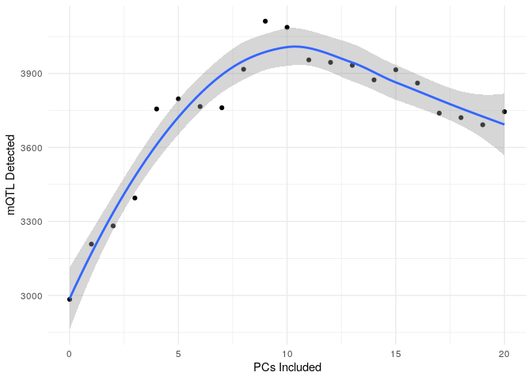

mQTL Training Module
================
William Casazza

  - [Objectives](#objectives)
  - [Preparing covariates for mQTL
    analysis](#preparing-covariates-for-mqtl-analysis)
      - [Formatting data for
        `MatrixEQTL`](#formatting-data-for-matrixeqtl)
          - [Required packages](#required-packages)
          - [Loading in required data](#loading-in-required-data)
          - [Example: Assigning a common ID to DNAm and genotyping data
            and
            metadata](#example-assigning-a-common-id-to-dnam-and-genotyping-data-and-metadata)
          - [Match Samples](#match-samples)
          - [Compute DNAm PCs](#compute-dnam-pcs)
          - [Write out `MatrixEQTL` files](#write-out-matrixeqtl-files)
      - [Running the final mQTL
        analysis](#running-the-final-mqtl-analysis)
  - [References](#references)

# Objectives

1.  Basics of molecular quantitative trait locus (molQTL) analysis
2.  Running cis-methylation QTL analysis with the `matrixEQTL` package
3.  Post-hoc analyses involving molQTL and GWAS summary statistics \#
    Quantitative trait loci (QTL) basics Quantitative trait loci are
    “mapped” by computing the association between SNP genotype and a
    quantitative trait like DNA methylation (DNAm), gene expression, or
    some other epigenetic mark. Analysis pipelines for computing these
    “molecular” QTL, or molQTL, can be complex, and fully
    understanding each of the steps in these pipelines in detail can be
    daunting. In this tutorial, I break down molQTL analysis into
    general steps based on what is used in by the Genotype-Tissue
    Expression (GTEx) consortium. GTEx has more or less set the standard
    for computing expression QTL (eQTL), and as of writing they have
    recently computed mQTL across 8 tissues.<sup>1,2</sup> Their
    approach to simply mapping molQTL is summarized in the figure below:
    

For the purpose of this tutorial, we will assume that the following has
been done:

  - Quality control of Genotyping and molecular trait data (i.e., up
    until normalization)
  - Population structure estimation via computing genotype principal
    components<sup>3–5</sup>

# Preparing covariates for mQTL analysis

The Rhode Island Children’s Health Study (RICHS)

## Formatting data for `MatrixEQTL`

`MatrixEQTL` is a package that efficiently runs linear regression
through the use of large matrix operations.<sup>6</sup> There are
several alternative molQTL-mapping software that offer their own
advantages such as fast permutation procedure for estimating
significance<sup>7,8</sup> or alternatives to linear models.<sup>9</sup>

`MatrixEQTL` is relatively simple to run, and as it reports results from
simple linear regression it is straightforward to interpret. The
required formats are shown in their [online
documentation](https://www.bios.unc.edu/research/genomic_software/Matrix_eQTL/runit.html#own).
In brief, we will need the following tab or whitespace-delimited files:
- covariates: the first column being the ID of each covariate, with
subsequent columns being each sample - Genotypes: The first column being
the rsID or SNP-identifier, with subsequent columns being each sample -
Quantitative trait: The first column being a “gene” id or molecular
trait identifier, with subsequent columns being each sample - position
files - Genotypes: SNP identifier, chromosome, position - Molecular
trait: gene/trait identifier, chromosome, start, end

### Required packages

    ## Warning: package 'tidyverse' was built under R version 4.0.3

    ## ── Attaching packages ─────────────────────────────────────── tidyverse 1.3.0 ──

    ## ✔ ggplot2 3.3.3     ✔ purrr   0.3.4
    ## ✔ tibble  3.1.0     ✔ dplyr   1.0.4
    ## ✔ tidyr   1.1.3     ✔ stringr 1.4.0
    ## ✔ readr   1.4.0     ✔ forcats 0.5.1

    ## Warning: package 'ggplot2' was built under R version 4.0.3

    ## Warning: package 'tibble' was built under R version 4.0.3

    ## Warning: package 'tidyr' was built under R version 4.0.3

    ## Warning: package 'readr' was built under R version 4.0.3

    ## Warning: package 'dplyr' was built under R version 4.0.3

    ## Warning: package 'forcats' was built under R version 4.0.3

    ## ── Conflicts ────────────────────────────────────────── tidyverse_conflicts() ──
    ## ✖ dplyr::filter() masks stats::filter()
    ## ✖ dplyr::lag()    masks stats::lag()

    ## Warning: package 'data.table' was built under R version 4.0.3

    ## 
    ## Attaching package: 'data.table'

    ## The following objects are masked from 'package:dplyr':
    ## 
    ##     between, first, last

    ## The following object is masked from 'package:purrr':
    ## 
    ##     transpose

    ## Loading required package: BiocGenerics

    ## Loading required package: parallel

    ## 
    ## Attaching package: 'BiocGenerics'

    ## The following objects are masked from 'package:parallel':
    ## 
    ##     clusterApply, clusterApplyLB, clusterCall, clusterEvalQ,
    ##     clusterExport, clusterMap, parApply, parCapply, parLapply,
    ##     parLapplyLB, parRapply, parSapply, parSapplyLB

    ## The following objects are masked from 'package:MatrixEQTL':
    ## 
    ##     colnames, rownames

    ## The following objects are masked from 'package:dplyr':
    ## 
    ##     combine, intersect, setdiff, union

    ## The following objects are masked from 'package:stats':
    ## 
    ##     IQR, mad, sd, var, xtabs

    ## The following objects are masked from 'package:base':
    ## 
    ##     anyDuplicated, append, as.data.frame, basename, cbind, colnames,
    ##     dirname, do.call, duplicated, eval, evalq, Filter, Find, get, grep,
    ##     grepl, intersect, is.unsorted, lapply, Map, mapply, match, mget,
    ##     order, paste, pmax, pmax.int, pmin, pmin.int, Position, rank,
    ##     rbind, Reduce, rownames, sapply, setdiff, sort, table, tapply,
    ##     union, unique, unsplit, which, which.max, which.min

    ## Loading required package: GenomicRanges

    ## Loading required package: stats4

    ## Loading required package: S4Vectors

    ## 
    ## Attaching package: 'S4Vectors'

    ## The following objects are masked from 'package:data.table':
    ## 
    ##     first, second

    ## The following objects are masked from 'package:dplyr':
    ## 
    ##     first, rename

    ## The following object is masked from 'package:tidyr':
    ## 
    ##     expand

    ## The following object is masked from 'package:base':
    ## 
    ##     expand.grid

    ## Loading required package: IRanges

    ## 
    ## Attaching package: 'IRanges'

    ## The following object is masked from 'package:data.table':
    ## 
    ##     shift

    ## The following objects are masked from 'package:dplyr':
    ## 
    ##     collapse, desc, slice

    ## The following object is masked from 'package:purrr':
    ## 
    ##     reduce

    ## Loading required package: GenomeInfoDb

    ## Loading required package: SummarizedExperiment

    ## Loading required package: Biobase

    ## Welcome to Bioconductor
    ## 
    ##     Vignettes contain introductory material; view with
    ##     'browseVignettes()'. To cite Bioconductor, see
    ##     'citation("Biobase")', and for packages 'citation("pkgname")'.

    ## Loading required package: DelayedArray

    ## Loading required package: matrixStats

    ## Warning: package 'matrixStats' was built under R version 4.0.3

    ## 
    ## Attaching package: 'matrixStats'

    ## The following objects are masked from 'package:Biobase':
    ## 
    ##     anyMissing, rowMedians

    ## The following object is masked from 'package:dplyr':
    ## 
    ##     count

    ## 
    ## Attaching package: 'DelayedArray'

    ## The following objects are masked from 'package:matrixStats':
    ## 
    ##     colMaxs, colMins, colRanges, rowMaxs, rowMins, rowRanges

    ## The following object is masked from 'package:purrr':
    ## 
    ##     simplify

    ## The following objects are masked from 'package:base':
    ## 
    ##     aperm, apply, rowsum

    ## Loading required package: Biostrings

    ## Loading required package: XVector

    ## 
    ## Attaching package: 'XVector'

    ## The following object is masked from 'package:purrr':
    ## 
    ##     compact

    ## 
    ## Attaching package: 'Biostrings'

    ## The following object is masked from 'package:base':
    ## 
    ##     strsplit

    ## Loading required package: bumphunter

    ## Loading required package: foreach

    ## Warning: package 'foreach' was built under R version 4.0.3

    ## 
    ## Attaching package: 'foreach'

    ## The following objects are masked from 'package:purrr':
    ## 
    ##     accumulate, when

    ## Loading required package: iterators

    ## Warning: package 'iterators' was built under R version 4.0.3

    ## Loading required package: locfit

    ## locfit 1.5-9.4    2020-03-24

    ## 
    ## Attaching package: 'locfit'

    ## The following object is masked from 'package:purrr':
    ## 
    ##     none

    ## Setting options('download.file.method.GEOquery'='auto')

    ## Setting options('GEOquery.inmemory.gpl'=FALSE)

### Loading in required data

molQTL data are split into each set of measurements with only partially
overlapping samples. This is for a variety of reasons. In the case of
RICHS, it is because the DNAm data was first used in a separate
publication consisting of more subjects,<sup>10</sup> with the
genotpying data published separately as part of an eQTL
analysis.<sup>11,12</sup>

This means that we need to harmonize IDs across both the DNAm and
genotyping data **and** their respective metadata, which makes it easier
to ensure that samples are in the same order prior to running
`MatrixEQTL`. Other software may do this reordering automatically based
on IDs, but it is a good idea to match he order of samples based on a
shared ID just in case this is not true. In the case of RICHS, we
required a file mapping IDs from GEO, where we retrieved DNAm, to those
on dbGaP.

### Example: Assigning a common ID to DNAm and genotyping data and metadata

``` r
methy_annot <- as.data.table(
  getAnnotation(
    IlluminaHumanMethylation450kanno.ilmn12.hg19 # Information on 450k probes
  )
)
richs_ancestry <- fread("data/population-structure.eigenvec") #Genotype PCs 
pheno <- fread("data/phenotypes.txt") # phenotype/covariate information
sample_multi <- fread("data/genotype-sample-ids.txt")
fam <- read.delim("data/raw-data.fam",header=FALSE,sep="") # RICHS '.fam' file
mapping <- fread("data/RICHS_dbgap_GEO_subject_sample_mapping.csv")

# Create single metadata table with all non-hidden covariates and sample labels
combined_meta <- pheno %>%
    left_join(
        sample_multi
    )%>% filter(SAMPLE_USE == "Array_SNP")
```

    ## Joining, by = c("dbGaP_Subject_ID", "SUBJECT_ID")

``` r
richs_meta <- combined_meta
richs_meta$IID <- richs_meta$SAMPLE_ID
richs_meta_methy <- fread("data/methylation-metadata.csv") %>% 
  inner_join(mapping,by=c("sample"= "GSM_SampleID"))
richs_meta <- richs_meta %>%
  right_join(richs_ancestry,by=c("IID"="V2")) %>%
  right_join(richs_meta_methy,by="SAMPLE_ID") %>%
  filter(SAMPLE_ID %in% richs_ancestry$V2)

methylation <- fread("data/processed_DNAm_RICHS_functional_norm.txt.gz") 
genotype <- fread("data/RICHS-genotype.traw.gz") # plink tab-delimited genotype 

# Part of genotype id before '_' character was redundant:
colnames(genotype) <- gsub(".*_","",colnames(genotype)) 
```

### Match Samples

``` r
# Filter to subjects with both genotype and DNAm
richs_meta <- richs_meta[
  IID %in% colnames(genotype) & geo_accession %in% colnames(methylation)
]
gen_vars <- c(colnames(genotype)[1:6],richs_meta$IID)
to_delete <- colnames(genotype)[!colnames(genotype)%in% gen_vars]
genotype[,c(to_delete):=NULL]
```

    ## Warning in `[.data.table`(genotype, , `:=`(c(to_delete), NULL)): length(LHS)==0;
    ## no columns to delete or assign RHS to.

``` r
# match sample order
setcolorder(genotype,gen_vars)
methy_vars <- c("cpg",richs_meta$geo_accession)
methylation <- methylation[,methy_vars,with=FALSE]

# Check if samples match
all(colnames(methylation)[-c(1)] == richs_meta$geo_accession)
```

    ## [1] TRUE

``` r
all(colnames(genotype)[-c(1:6)] == richs_meta$IID)
```

    ## [1] TRUE

### Compute DNAm PCs

In addition to known variation due to measured covariates, we also
account for “hidden” covariates in whichever quantitative trait we are
measuring. “Hidden” covariates are any possible variable that affects
global DNAm that could also explain the association between a single SNP
and a quantitative trait.<sup>13,14</sup> This is computed a number of
methods, most of which are closely tied to principal components
analysis. For example, GTEx uses a variable number of PEER factors
computed from gene expression to account for hidden
variation,<sup>1,15</sup> but there are several others including SVA,
HCP, or PCA alone.<sup>13,14,16,17</sup>

On the other hand, PCA itself is often easier to apply, and performs as
well as or better than the methods listed above in reducing false
positives, and in improving our power to detect molQTL.<sup>14</sup> We
compute the optimal number of DNAm PCs to include using the “elbow”
method. First, we take a subset of SNPs, in this example those on
chromosome 21, and compute mQTL accounting for an increasing number of
principal components. The optimal number of PCs to include is when we
stop detecting more mQTL with each successive PC.

#### Example: PCA in RICHS DNAm

In some cases, you may want to regress out or account for covariates
affecting DNAm prior to computing PCs. This is conceptually similar to
what is done with methods like PEER or HCP, or even ComBat, which is a
commonly used method in processing DNAm for epigenome-wide association
studies.<sup>13,15,17</sup> Below, I included the option of performing
this procedure before computing DNAm PCs, but note that it is not
necessary and that you should have a justification for doing so when
writing up your analysis.

In this module, we will compute 20 DNAm PCs using methylation from all
autosomes and the X chromosome (plan to include X-chromosome analysis in
our project).

``` r
REMOVE_COVARIATES <- FALSE # Change to TRUE to regress out covariates before PCA
covars <- richs_meta %>% as.data.frame() %>%
                dplyr::select(
                    age,
                    V3,
                    V4,
                    V5,
                    V6,
                    V7,
                    sex
                ) %>%
                mutate(Sex= as.numeric(sex =="M"))%>%
                dplyr::select(-sex) %>%
                as.data.frame()
if(REMOVE_COVARIATES == TRUE){
  matrix_methy <- as.matrix(
    t(
      methylation[!cpg %in% methy_annot[chr %in% c("chrX","chrY")]$Name ,-c(1)]
    )
  )
  residual <- residuals(lm(matrix_methy ~ ., data=covars))
  methy_PC <- prcomp(residual, center=T,rank.= 20)
}else{
  methy_PC <- prcomp(as.matrix(t(methylation[,-c(1)])), center=T,rank.= 20)
}
```

### Write out `MatrixEQTL` files

Since we first need to find the proper number of DNAm PCs to include in
our model, we need to generate a covariate file for each additional PC
we’re adding, We need to generate genotype and methylation files for
just chromosome 21 so that we have a subset to test these varying number
of PCs.

#### Covariate files

Our model for this mQTL analysis is:
\[ DNAm_j \sim (intercept)+SNP_i + \text{Sex} + \text{Gestational Age} +
\text{Genotype PCs}_{1\dots 5} + \text{DNAm PCs}_{0\dots k}\]

In the code below, we place sex last since MatrixEQTL has an option to
include an interaction term for the last variable. `MatrixEQTL` adds in
the intercept term automatically:

``` r
fmt <- "data/mQTL_covar_%d_methy_PC.txt"
for(i in 0:20){
    if (i==1){
        tmp <- t(cbind(PC1=methy_PC$x[,1:i],richs_meta %>% as.data.frame() %>%
                dplyr::select(
                    age,
                    V3,# V3-V7 are the first 5 Genotyping PCs
                    V4,
                    V5,
                    V6,
                    V7,
                    sex
                )) %>%
                mutate(Sex= as.numeric(sex =="M"))%>%
                dplyr::select(-sex)) %>%
                as.data.frame()

    }else if (i==0){
          tmp <- t(cbind(richs_meta %>% as.data.frame() %>%
               dplyr::select(
                    age,
                    V3,
                    V4,
                    V5,
                    V6,
                    V7,
                    sex
                )) %>%
                mutate(Sex= as.numeric(sex =="M"))%>%
                dplyr::select(-sex)) %>%
                as.data.frame()
    }else{
        tmp <- t(cbind(methy_PC$x[,1:i],
                richs_meta %>% as.data.frame() %>%
                dplyr::select(
                    age,
                    V3,
                    V4,
                    V5,
                    V6,
                    V7,
                    sex
                )) %>%
                mutate(Sex= as.numeric(sex =="M"))%>%
                dplyr::select(-sex)) %>%

                as.data.frame()

    }
  colnames(tmp) <- richs_meta$IID
  fwrite(
    tmp %>% rownames_to_column(var="id"),
    file=sprintf(fmt,i),
    sep="\t",
    quote=F
  )
}
```

#### Writing out genotype and methylation data

``` r
# SNP position files
fwrite(genotype[,.(SNP,CHR=paste0("chr",CHR),POS)],
       "data/snp_pos.txt",
       sep="\t",
       quote=F
)
fwrite(
  genotype[CHR==21,.(SNP,CHR=paste0("chr",CHR),POS)],
  "data/snp_pos_chr21.txt",
  sep = "\t",
  quote=F
)

# Methylation position files
fwrite(
  methy_annot[Name %in% methylation$cpg,.(geneid=Name,chr,s1=pos,s2=pos)],
  "data/probe_pos.txt",
  sep = "\t",
  quote=F
)
fwrite(
  methy_annot[
    Name %in% methylation$cpg & chr=="chr21",
    .(geneid=Name, chr,s1=pos,s2=pos)
  ],
  "data/probe_pos_chr21.txt",
  sep = "\t",
  quote=F
)

# Genotype
geno_vars <- colnames(genotype)[c(1,3:6)]
genotype[,c(geno_vars):=NULL]
fwrite(genotype,"data/all_imputed_matrixeQTL.txt",sep = "\t",quote = F)
snp_pos <- fread("data/snp_pos.txt")
fwrite(
  genotype[SNP %in% snp_pos[CHR=="chr21"]$SNP],
  "data/all_imputed_matrixeQTL_chr21.txt",
  sep = "\t",
  quote = F
)

# Methylation
fwrite(methylation,"data/methylation_matrixeQTL.txt",sep="\t",quote=F)
chr21_cpg <- methy_annot[Name %in% methylation$cpg & chr == "chr21",]$Name
fwrite(
  methylation[cpg %in% chr21_cpg],
  "data/methylation_matrixeQTL_chr21.txt",
  sep="\t",
  quote=F
)
```

#### Selecting the optimal number of PCs

`MatrixEQTL` can be run to compute the association between all SNPs
within 75 kb of a CpG site<sup>18–21</sup> using the R script
[`run_cis_mQTL_75k.R`](scripts/run_cis_mQTL_75k.R):

By default, the above script will print all pairwise associations. If
you are computing a large number of mQTL, for example using the EPIC
array, you may want to restrict the output to only include associations
with \(p < 0.25\), which can be done by setting `pv_out_threshold
<- 0.25`.

For our PC experiment, we will use an array job to compute mQTL on
chromosome 21 accounting for 0-20 DNAm PCs, running each set of
covariates in parallel with the chromosome 21 data we saved before. See
[run\_mQTL\_PCs.pbs](scripts/run_mQTL_PCs.pbs):

``` bash
```

Pay attention to the location of your data, whether your account
information is correct in the \#PBS header, and whether your current R
setup requires some adjustments such that your job can run the `Rscript`
command with the `MatrixEQTL` package installed.

This script is submitted as follows:

``` bash
qsub scripts/run_mQTL_PCs.pbs
```

The output of the above script should be a list of mQTL files listing
PCs from 0-20. We can plot the number of associations significant at a
Bonferroni corrected \(p < 0.05\) per each additional PC in our model:

``` r
fmt <- "data/cis_all_impute_mQTL_results_%d_methy_PC_chr21.txt"
chr21_res <- lapply(
  0:20,
  function(i){
    tmp <- fread(sprintf(fmt,i))
    nrow(tmp[`p-value` < (0.05/ .N)])
  }
)
to_plot <- data.frame(PC=0:20,hits=unlist(chr21_res))
ggplot(to_plot,aes(PC,hits)) +
  geom_point() +
  geom_smooth() +
  labs(x="PCs Included",y="mQTL Detected") +
  theme_minimal()
```

    ## `geom_smooth()` using method = 'loess' and formula 'y ~ x'

<!-- -->

From above it looks like after 9 PCs, we stop improving our ability to
detect mQTL. In larger sample sizes (e.g., \(N > 250\)), we often
observe that the number of hits levels off at a certain number of PCs
included in the model.

## Running the final mQTL analysis

We can modify the script we used to run `MatrixEQTL` for different
numbers of PCs to simply run our entire cis-mQTL analysis for one set of
covariates. See [run\_mQTL\_all.pbs](scripts/run_mQTL_all.pbs):

``` bash
```

# References

<div id="refs" class="references">

<div id="ref-thegtexconsortiumGTExConsortiumAtlas2020">

1\. THE GTEX CONSORTIUM. The GTEx Consortium atlas of genetic regulatory
effects across human tissues. *Science* **369**, 1318–1330 (2020).

</div>

<div id="ref-olivaDNAMethylationQTL2023">

2\. Oliva, M. *et al.* DNA methylation QTL mapping across diverse human
tissues provides molecular links between genetic variation and complex
traits. *Nature Genetics* 1–11 (2023)
doi:[10.1038/s41588-022-01248-z](https://doi.org/10.1038/s41588-022-01248-z).

</div>

<div id="ref-sulPopulationStructureGenetic2018">

3\. Sul, J. H., Martin, L. S. & Eskin, E. Population structure in
genetic studies: Confounding factors and mixed models. *PLoS Genetics*
**14**, e1007309 (2018).

</div>

<div id="ref-pricePrincipalComponentsAnalysis2006">

4\. Price, A. L. *et al.* Principal components analysis corrects for
stratification in genome-wide association studies. *Nature Genetics*
**38**, 904–909 (2006).

</div>

<div id="ref-elhaikPrincipalComponentAnalyses2022">

5\. Elhaik, E. Principal Component Analyses (PCA)-based findings in
population genetic studies are highly biased and must be reevaluated.
*Scientific Reports* **12**, 14683 (2022).

</div>

<div id="ref-andreya.shabalinMatrixEQTLUltra2012">

6\. Andrey A. Shabalin. Matrix eQTL: Ultra fast eQTL analysis via large
matrix operations. *Bioinformatics* **28**, 1353–1358 (2012).

</div>

<div id="ref-ongenFastEfficientQTL2016">

7\. Ongen, H., Buil, A., Brown, A. A., Dermitzakis, E. T. & Delaneau, O.
Fast and efficient QTL mapper for thousands of molecular phenotypes.
*Bioinformatics* **32**, 1479–1485 (2016).

</div>

<div id="ref-delaneauCompleteToolSet2017">

8\. Delaneau, O. *et al.* A complete tool set for molecular QTL
discovery and analysis. *Nature Communications* **8**, 15452 (2017).

</div>

<div id="ref-leeGenomeWideExpressionQuantitative2018">

9\. Lee, C. Genome-Wide Expression Quantitative Trait Loci Analysis
Using Mixed Models. *Frontiers in Genetics* **9**, (2018).

</div>

<div id="ref-paquetteRegionsVariableDNA2016a">

10\. Paquette, A. G. *et al.* Regions of variable DNA methylation in
human placenta associated with newborn neurobehavior. *Epigenetics*
**11**, 603–613 (2016).

</div>

<div id="ref-pengExpressionQuantitativeTrait2017">

11\. Peng, S. *et al.* Expression quantitative trait loci (eQTLs) in
human placentas suggest developmental origins of complex diseases.
*Human Molecular Genetics* **26**, 3432–3441 (2017).

</div>

<div id="ref-pengGeneticRegulationPlacental2018">

12\. Peng, S. *et al.* Genetic regulation of the placental transcriptome
underlies birth weight and risk of childhood obesity. *PLOS Genetics*
**14**, e1007799 (2018).

</div>

<div id="ref-mostafaviNormalizingRNASequencingData2013">

13\. Mostafavi, S. *et al.* Normalizing RNA-Sequencing Data by Modeling
Hidden Covariates with Prior Knowledge. *PLoS ONE* **8**, (2013).

</div>

<div id="ref-zhouPCAOutperformsPopular2022">

14\. Zhou, H. J., Li, L., Li, Y., Li, W. & Li, J. J. PCA outperforms
popular hidden variable inference methods for molecular QTL mapping.
*Genome Biology* **23**, 210 (2022).

</div>

<div id="ref-stegleUsingProbabilisticEstimation2012">

15\. Stegle, O., Parts, L., Piipari, M., Winn, J. & Durbin, R. Using
probabilistic estimation of expression residuals (PEER) to obtain
increased power and interpretability of gene expression analyses.
*Nature protocols* **7**, 500–507 (2012).

</div>

<div id="ref-leek2007a">

16\. Leek, J. T. & Storey, J. D. Capturing heterogeneity in gene
expression studies by surrogate variable analysis. *PLoS genetics*
**3**, 1724–1735 , (2007).

</div>

<div id="ref-leekSvaPackageRemoving2012">

17\. Leek, J. T., Johnson, W. E., Parker, H. S., Jaffe, A. E. & Storey,
J. D. The sva package for removing batch effects and other unwanted
variation in high-throughput experiments. *Bioinformatics* **28**,
882–883 (2012).

</div>

<div id="ref-smithMethylationQuantitativeTrait2014">

18\. Smith, A. K. *et al.* Methylation quantitative trait loci (meQTLs)
are consistently detected across ancestry, developmental stage, and
tissue type. *BMC Genomics* **15**, 145 (2014).

</div>

<div id="ref-doMechanismsDiseaseAssociations2016">

19\. Do, C. *et al.* Mechanisms and Disease Associations of
Haplotype-Dependent Allele-Specific DNA Methylation. *American Journal
of Human Genetics* **98**, 934–955 (2016).

</div>

<div id="ref-shiCharacterizingGeneticBasis2014">

20\. Shi, J. *et al.* Characterizing the genetic basis of methylome
diversity in histologically normal human lung tissue. *Nature
Communications* **5**, 3365 (2014).

</div>

<div id="ref-zhangLinkingGeneticArchitecture2014">

21\. Zhang, X. *et al.* Linking the genetic architecture of cytosine
modifications with human complex traits. *Human Molecular Genetics*
**23**, 5893–5905 (2014).

</div>

</div>
