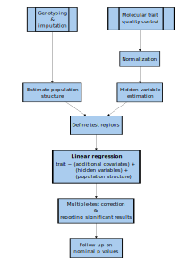
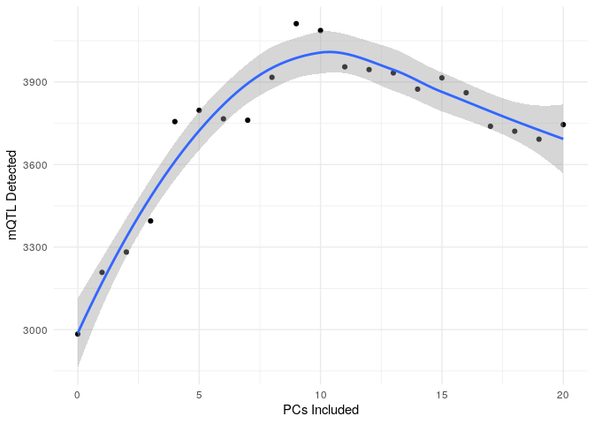

mQTL Training Module
================
William Casazza

- [Objectives](#objectives)
- [Quantitative trait loci (QTL)
  basics](#quantitative-trait-loci-qtl-basics)
- [Example: mQTL analysis in the RICHS
  study](#example-mqtl-analysis-in-the-richs-study)
  - [Required packages](#required-packages)
  - [Loading in required data](#loading-in-required-data)
  - [Assigning a common ID to DNAm and genotyping data and
    metadata](#assigning-a-common-id-to-dnam-and-genotyping-data-and-metadata)
  - [Match Samples](#match-samples)
  - [Preparing covariates for mQTL
    analysis](#preparing-covariates-for-mqtl-analysis)
    - [Hidden Covariates](#hidden-covariates)
    - [Formatting `MatrixEQTL` files](#formatting-matrixeqtl-files)
- [Running the final mQTL analysis](#running-the-final-mqtl-analysis)
- [References](#references)

# Objectives

1.  Basics of molecular quantitative trait locus (molQTL) analysis
2.  Running cis-methylation QTL analysis with the `matrixEQTL` package

# Quantitative trait loci (QTL) basics

Quantitative trait loci are “mapped” by computing the association
between SNP genotype and a quantitative trait likeDNA methylation
(DNAm), gene expression, or some other epigenetic mark. Analysis
pipelines for computing these “molecular” QTL, or molQTL, can be
complex, and fully understanding each of the steps in these pipelines in
detail can be daunting. In this tutorial, I break down molQTL analysis
into general steps that are based on what is used by the Genotype-Tissue
Expression (GTEx) consortium. GTEx has set the standard for computing
expression QTL (eQTL), and as of writing they have computed mQTL across
8 tissues<sup>1,2</sup>. Their approach is summarized in the figure
below: 

For the purpose of this tutorial, we will assume that the following has
been done:

- Quality control of Genotyping and molecular trait data (i.e., up until
  normalization)
- Population structure estimation via computing genotype principal
  components<sup>3–5</sup>

# Example: mQTL analysis in the RICHS study

We will be using data from the Rhode Island Child Health Study (RICHS),
which contains 450K Array Data for DNAm and SNP genotype for roughly
$N=136$ placental samples. The original data can be requested from
[GEO](https://www.ncbi.nlm.nih.gov/geo/query/acc.cgi?acc=GSE75248) and
[dbGaP](https://www.ncbi.nlm.nih.gov/projects/gap/cgi-bin/study.cgi?study_id=phs001586.v1.p1).
\## Formatting data for `MatrixEQTL`

`MatrixEQTL` is a package that efficiently runs linear regression
through the use of large matrix operations.<sup>6</sup> There are
several alternative molQTL-mapping software that offer their own
advantages such as fast permutation procedure for estimating
significance<sup>7,8</sup> or alternatives to linear models.<sup>9</sup>

`MatrixEQTL` is relatively simple to run, and as it reports results from
simple linear regression it is straightforward to interpret. The
required formats are shown in their [online
documentation](https://www.bios.unc.edu/research/genomic_software/Matrix_eQTL/runit.html#own).
In brief, we will need the following tab or whitespace-delimited
files: - covariates: the first column being the ID of each covariate,
with subsequent columns being each sample - Genotypes: The first column
being the rsID or SNP-identifier, with subsequent columns being each
sample - Quantitative trait: The first column being a “gene” id or
molecular trait identifier, with subsequent columns being each sample -
position files - Genotypes: SNP identifier, chromosome, position -
Molecular trait: gene/trait identifier, chromosome, start, end

### Required packages

``` r
knitr::opts_chunk$set(eval = FALSE) # Change to TRUE if you want all chunks to be run
```

### Loading in required data

molQTL data are split into each set of measurements with only partially
overlapping samples. This is for a variety of reasons. In the case of
RICHS, it is because the DNAm data was first used in a separate
publication consisting of more subjects,<sup>10</sup> with the
genotpying data published separately as part of an eQTL
analysis.<sup>11,12</sup>

This means that we need to harmonize IDs across both the DNAm and
genotyping data **and** their respective metadata, which makes it easier
to ensure that samples are in the same order prior to running
`MatrixEQTL`. Other software may do this reordering automatically based
on IDs, but it is a good idea to match he order of samples based on a
shared ID just in case this is not true. In the case of RICHS, we
required a file mapping IDs from GEO, where we retrieved DNAm, to those
on dbGaP.

### Assigning a common ID to DNAm and genotyping data and metadata

``` r
methy_annot <- as.data.table(
  getAnnotation(
    IlluminaHumanMethylation450kanno.ilmn12.hg19 # Information on 450k probes
  )
)
richs_ancestry <- fread("data/population-structure.eigenvec") #Genotype PCs 
pheno <- fread("data/phenotypes.txt") # phenotype/covariate information
sample_multi <- fread("data/genotype-sample-ids.txt")
fam <- read.delim("data/raw-data.fam",header=FALSE,sep="") # RICHS '.fam' file
mapping <- fread("data/RICHS_dbgap_GEO_subject_sample_mapping.csv")

# Create single metadata table with all non-hidden covariates and sample labels
combined_meta <- pheno %>%
    left_join(
        sample_multi
    )%>% filter(SAMPLE_USE == "Array_SNP")
richs_meta <- combined_meta
richs_meta$IID <- richs_meta$SAMPLE_ID
richs_meta_methy <- fread("data/methylation-metadata.csv") %>% 
  inner_join(mapping,by=c("sample"= "GSM_SampleID"))
richs_meta <- richs_meta %>%
  right_join(richs_ancestry,by=c("IID"="V2")) %>%
  right_join(richs_meta_methy,by="SAMPLE_ID") %>%
  filter(SAMPLE_ID %in% richs_ancestry$V2)

methylation <- fread("data/processed_DNAm_RICHS_functional_norm.txt.gz") 
genotype <- fread("data/RICHS-genotype.traw.gz") # plink tab-delimited genotype 

# Part of genotype id before '_' character was redundant:
colnames(genotype) <- gsub(".*_","",colnames(genotype)) 
```

### Match Samples

``` r
# Filter to subjects with both genotype and DNAm
richs_meta <- richs_meta[
  IID %in% colnames(genotype) & geo_accession %in% colnames(methylation)
]
gen_vars <- c(colnames(genotype)[1:6],richs_meta$IID)
to_delete <- colnames(genotype)[!colnames(genotype)%in% gen_vars]
genotype[,c(to_delete):=NULL]

# match sample order
setcolorder(genotype,gen_vars)
methy_vars <- c("cpg",richs_meta$geo_accession)
methylation <- methylation[,methy_vars,with=FALSE]

# Check if samples match
all(colnames(methylation)[-c(1)] == richs_meta$geo_accession)
all(colnames(genotype)[-c(1:6)] == richs_meta$IID)
```

## Preparing covariates for mQTL analysis

### Hidden Covariates

In addition to known variation due to measured covariates, we also
account for “hidden” covariates in whichever quantitative trait we are
measuring. “Hidden” covariates are any possible variable that affects
global DNAm that could also explain the association between a single SNP
and a quantitative trait.<sup>13,14</sup> This is computed a number of
methods, most of which are closely tied to principal components
analysis. For example, GTEx uses a variable number of PEER factors
computed from gene expression to account for hidden
variation,<sup>1,15</sup> but there are several others including SVA,
HCP, or PCA alone.<sup>13,14,16,17</sup>

On the other hand, PCA itself is often easier to apply, and performs as
well as or better than the methods listed above in reducing false
positives, and in improving our power to detect molQTL.<sup>14</sup> We
compute the optimal number of DNAm PCs to include using the “elbow”
method. First, we take a subset of SNPs, in this example those on
chromosome 21, and compute mQTL accounting for an increasing number of
principal components. The optimal number of PCs to include is when we
stop detecting more mQTL with each successive PC.

#### Example: PCA in RICHS DNAm

In some cases, you may want to regress out or account for covariates
affecting DNAm prior to computing PCs. This is conceptually similar to
what is done with methods like PEER or HCP, or even ComBat, which is a
commonly used method in processing DNAm for epigenome-wide association
studies.<sup>13,15,17</sup> Below, I included the option of performing
this procedure before computing DNAm PCs, but note that it is not
necessary and that you should have a justification for doing so when
writing up your analysis.

In this module, we will compute 20 DNAm PCs using methylation from all
autosomes and the X chromosome (plan to include X-chromosome analysis in
our project).

``` r
REMOVE_COVARIATES <- FALSE # Change to TRUE to regress out covariates before PCA
covars <- richs_meta %>% as.data.frame() %>%
                dplyr::select(
                    age,
                    V3,
                    V4,
                    V5,
                    V6,
                    V7,
                    sex
                ) %>%
                mutate(Sex= as.numeric(sex =="M"))%>%
                dplyr::select(-sex) %>%
                as.data.frame()
if(REMOVE_COVARIATES == TRUE){
  matrix_methy <- as.matrix(
    t(
      methylation[!cpg %in% methy_annot[chr %in% c("chrX","chrY")]$Name ,-c(1)]
    )
  )
  residual <- residuals(lm(matrix_methy ~ ., data=covars))
  methy_PC <- prcomp(residual, center=T,rank.= 20)
}else{
  methy_PC <- prcomp(as.matrix(t(methylation[,-c(1)])), center=T,rank.= 20)
}
```

### Formatting `MatrixEQTL` files

Since we first need to find the proper number of DNAm PCs to include in
our model, we need to generate a covariate file for each additional PC
we’re adding, We need to generate genotype and methylation files for
just chromosome 21 so that we have a subset to test these varying number
of PCs.

#### Covariate files

Our model for this mQTL analysis is:
$$ DNAm_j \sim (intercept)+SNP_i + \text{Sex} + \text{Gestational Age} +
\text{Genotype PCs}_{1\dots 5} + \text{DNAm PCs}_{0\dots k}$$

In the code below, we place sex last since MatrixEQTL has an option to
include an interaction term for the last variable. `MatrixEQTL` adds in
the intercept term automatically:

``` r
fmt <- "data/mQTL_covar_%d_methy_PC.txt"
for(i in 0:20){
    if (i==1){
        tmp <- t(cbind(PC1=methy_PC$x[,1:i],richs_meta %>% as.data.frame() %>%
                dplyr::select(
                    age,
                    V3,# V3-V7 are the first 5 Genotyping PCs
                    V4,
                    V5,
                    V6,
                    V7,
                    sex
                )) %>%
                mutate(Sex= as.numeric(sex =="M"))%>%
                dplyr::select(-sex)) %>%
                as.data.frame()

    }else if (i==0){
          tmp <- t(cbind(richs_meta %>% as.data.frame() %>%
               dplyr::select(
                    age,
                    V3,
                    V4,
                    V5,
                    V6,
                    V7,
                    sex
                )) %>%
                mutate(Sex= as.numeric(sex =="M"))%>%
                dplyr::select(-sex)) %>%
                as.data.frame()
    }else{
        tmp <- t(cbind(methy_PC$x[,1:i],
                richs_meta %>% as.data.frame() %>%
                dplyr::select(
                    age,
                    V3,
                    V4,
                    V5,
                    V6,
                    V7,
                    sex
                )) %>%
                mutate(Sex= as.numeric(sex =="M"))%>%
                dplyr::select(-sex)) %>%

                as.data.frame()

    }
  colnames(tmp) <- richs_meta$IID
  fwrite(
    tmp %>% rownames_to_column(var="id"),
    file=sprintf(fmt,i),
    sep="\t",
    quote=F
  )
}
```

#### Writing out genotype and methylation data

``` r
# SNP position files
fwrite(genotype[,.(SNP,CHR=paste0("chr",CHR),POS)],
       "data/snp_pos.txt",
       sep="\t",
       quote=F
)
fwrite(
  genotype[CHR==21,.(SNP,CHR=paste0("chr",CHR),POS)],
  "data/snp_pos_chr21.txt",
  sep = "\t",
  quote=F
)

# Methylation position files
fwrite(
  methy_annot[Name %in% methylation$cpg,.(geneid=Name,chr,s1=pos,s2=pos)],
  "data/probe_pos.txt",
  sep = "\t",
  quote=F
)
fwrite(
  methy_annot[
    Name %in% methylation$cpg & chr=="chr21",
    .(geneid=Name, chr,s1=pos,s2=pos)
  ],
  "data/probe_pos_chr21.txt",
  sep = "\t",
  quote=F
)

# Genotype
geno_vars <- colnames(genotype)[c(1,3:6)]
genotype[,c(geno_vars):=NULL]
fwrite(genotype,"data/all_imputed_matrixeQTL.txt",sep = "\t",quote = F)
snp_pos <- fread("data/snp_pos.txt")
fwrite(
  genotype[SNP %in% snp_pos[CHR=="chr21"]$SNP],
  "data/all_imputed_matrixeQTL_chr21.txt",
  sep = "\t",
  quote = F
)

# Methylation
fwrite(methylation,"data/methylation_matrixeQTL.txt",sep="\t",quote=F)
chr21_cpg <- methy_annot[Name %in% methylation$cpg & chr == "chr21",]$Name
fwrite(
  methylation[cpg %in% chr21_cpg],
  "data/methylation_matrixeQTL_chr21.txt",
  sep="\t",
  quote=F
)
```

#### Selecting the optimal number of PCs

`MatrixEQTL` can be run to compute the association between all SNPs
within 75 kb of a CpG site<sup>18–21</sup> using the R script
[`run_cis_mQTL_75k.R`](scripts/run_cis_mQTL_75k.R):

``` r
library(MatrixEQTL)
library(R.utils)

argv <- commandArgs(
  asValues = TRUE,
  defaults = list(
    data_dir = "",
    SNP_fname = "all_imputed_snps_matrixeQTL.txt",
    methylation_fname = "methylation_data_matrixeQTL.txt",
    cov_file = "mQTL_covar_10_methy_PC.txt",
    cis_outfile = "cis_mQTL.txt",
    snp_pos = "snp_pos.txt",
    probe_pos = "probe_pos.txt",
    model = "modelLINEAR"
  )
)
print(argv)
use_model <- get(argv$model)

data_dir <- argv$data_dir
SNP_fname <- paste0(data_dir, argv$SNP_fname)
methylation_fname <- paste0(data_dir, argv$methylation_fname)
cis_outfile <- paste0(data_dir, argv$cis_outfile)
pv_out_threshold <- 1.0 
error_cov <- numeric()
cis_dist <- 75000

methylation <- SlicedData$new()
methylation$fileDelimiter <- "\t"
methylation$fileOmitCharacters <- "NA"
methylation$fileSkipRows <- 1
methylation$fileSkipColumns <- 1
methylation$fileSliceSize <- 10000 # 2000 methylation at once
methylation$LoadFile(methylation_fname)
probe_pos <- read.delim(paste0(data_dir, argv$probe_pos), sep = "\t")

covariates <- SlicedData$new()
covariates$fileDelimiter <- "\t"
covariates$fileOmitCharacters <- "NA"
covariates$fileSkipRows <- 1
covariates$fileSkipColumns <- 1
covariates$LoadFile(paste0(data_dir, argv$cov_file))

snps <- SlicedData$new()
snps$fileDelimiter <- "\t"
snps$fileOmitCharacters <- "NA"
snps$fileSkipRows <- 1
snps$fileSkipColumns <- 1
snps$fileSliceSize <- 10000 # 10000 snps at once
snps$LoadFile(SNP_fname)
snp_pos <- read.delim(paste0(data_dir, argv$snp_pos), sep = "\t")
print(head(snp_pos))
print(head(probe_pos))
me <- Matrix_eQTL_main(
  snps = snps,
  gene = methylation,
  cvrt = covariates,
  output_file_name.cis = cis_outfile,
  pvOutputThreshold = 0,
  pvOutputThreshold.cis = pv_out_threshold,
  cisDist = cis_dist,
  snpspos = snp_pos,
  genepos = probe_pos,
  useModel = use_model,
  errorCovariance = error_cov,
  verbose = TRUE,
  pvalue.hist = "qqplot",
  min.pv.by.genesnp = FALSE,
  noFDRsaveMemory = FALSE
)
cat("Analysis done in: ", me$time.in.sec, " seconds", "\n")
cat("Detected local eQTLs:", "\n")
nrow(me$cis)
```

By default, the above script will print all pairwise associations. If
you are computing a large number of mQTL, for example using the EPIC
array, you may want to restrict the output to only include associations
with $p < 0.25$, which can be done by setting
`pv_out_threshold <- 0.25`.

For our PC experiment, we will use an array job to compute mQTL on
chromosome 21 accounting for 0-20 DNAm PCs, running each set of
covariates in parallel with the chromosome 21 data we saved before. See
[run_mQTL_PCs.pbs](scripts/run_mQTL_PCs.pbs):

``` bash
#!/bin/bash

#PBS -l walltime=05:00:00,select=1:ncpus=32:mem=192gb
#PBS -N mqtl_chr21_PCs
#PBS -A st-dennisjk-1
#PBS -m abe
#PBS -M willcasazza@gmail.com

PROJECT_DIR=/scratch/st-dennisjk-1/wcasazza/mQTL-analysis-module/ #Modify this
cd $PROJECT_DIR
run_mqtl_chr(){
   singularity exec /project/st-dennisjk-1/software/rstudio/rstudio.sif\
    Rscript scripts/run_cis_mqtl_75k.R --data_dir="data/" \
      --SNP_fname="all_imputed_matrixeQTL_chr21.txt"\
      --cov_file="mQTL_covar_${1}_methy_PC.txt"\
      --cis_outfile="cis_all_impute_mQTL_results_${1}_methy_PC_chr21.txt"\
      --snp_pos="snp_pos_chr21.txt"\
      --methylation_fname="methylation_matrixeQTL_chr21.txt"\
      --probe_pos="probe_pos_chr21.txt"
}

module load parallel
module load singularity

export -f run_mqtl_chr
parallel run_mqtl_chr ::: {0..20}
```

Pay attention to the location of your data, whether your account
information is correct in the \#PBS header, and whether your current R
setup requires some adjustments such that your job can run the `Rscript`
command with the `MatrixEQTL` package installed.

This script is submitted as follows:

``` bash
qsub scripts/run_mQTL_PCs.pbs
```

The output of the above script should be a list of mQTL files listing
PCs from 0-20. We can plot the number of associations significant at a
Bonferroni corrected $p < 0.05$ per each additional PC in our model:

``` r
fmt <- "data/cis_all_impute_mQTL_results_%d_methy_PC_chr21.txt"
chr21_res <- lapply(
  0:20,
  function(i){
    tmp <- fread(sprintf(fmt,i))
    nrow(tmp[`p-value` < (0.05/ .N)])
  }
)
to_plot <- data.frame(PC=0:20,hits=unlist(chr21_res))
ggplot(to_plot,aes(PC,hits)) +
  geom_point() +
  geom_smooth() +
  labs(x="PCs Included",y="mQTL Detected") +
  theme_minimal()
```

 From above it looks like after 9 PCs, we stop
improving our ability to detect mQTL. In larger sample sizes (e.g.,
$N > 250$), we often observe that the number of hits levels off at a
certain number of PCs included in the model.

# Running the final mQTL analysis

We can modify the script we used to run `MatrixEQTL` for different
numbers of PCs to simply run our entire cis-mQTL analysis for one set of
covariates. See [run_mQTL_all.pbs](scripts/run_mQTL_all.pbs):

``` bash
#!/bin/bash

#PBS -l walltime=05:00:00,select=1:ncpus=20:mem=100gb
#PBS -N RICHS_MQTL
#PBS -A st-dennisjk-1
#PBS -m abe
#PBS -M willcasazza@gmail.com

PROJECT_DIR=/scratch/st-dennisjk-1/wcasazza/mQTL-analysis-module/ #Modify this
cd $PROJECT_DIR

singularity exec /arc/project/st-dennisjk-1/software/rstudio/rstudio.sif\
  Rscript run_cis_mqtl_75k.R --data_dir="data/" \
        --SNP_fname="all_imputed_matrixeQTL.txt"\
        --cov_file="mQTL_covar_9_methy_PC.txt"\
        --cis_outfile="cis_mQTL_${mqtl_set}.txt"\
        --snp_pos="snp_pos.txt"\
        --methylation_fname="methylation_matrixeQTL.txt"\
        --probe_pos="probe_pos.txt"\
        --model="modelLINEAR"
```

# References

<div id="refs" class="references csl-bib-body" line-spacing="2">

<div id="ref-thegtexconsortiumGTExConsortiumAtlas2020"
class="csl-entry">

<span class="csl-left-margin">1.
</span><span class="csl-right-inline">THE GTEX CONSORTIUM. [The GTEx
Consortium atlas of genetic regulatory effects across human
tissues](https://doi.org/10.1126/science.aaz1776). *Science* **369**,
1318–1330 (2020).</span>

</div>

<div id="ref-olivaDNAMethylationQTL2023" class="csl-entry">

<span class="csl-left-margin">2.
</span><span class="csl-right-inline">Oliva, M. *et al.* DNA methylation
QTL mapping across diverse human tissues provides molecular links
between genetic variation and complex traits. *Nature Genetics* 1–11
(2023)
doi:[10.1038/s41588-022-01248-z](https://doi.org/10.1038/s41588-022-01248-z).</span>

</div>

<div id="ref-sulPopulationStructureGenetic2018" class="csl-entry">

<span class="csl-left-margin">3.
</span><span class="csl-right-inline">Sul, J. H., Martin, L. S. & Eskin,
E. [Population structure in genetic studies: Confounding factors and
mixed models](https://doi.org/10.1371/journal.pgen.1007309). *PLoS
Genetics* **14**, e1007309 (2018).</span>

</div>

<div id="ref-pricePrincipalComponentsAnalysis2006" class="csl-entry">

<span class="csl-left-margin">4.
</span><span class="csl-right-inline">Price, A. L. *et al.* [Principal
components analysis corrects for stratification in genome-wide
association studies](https://doi.org/10.1038/ng1847). *Nature Genetics*
**38**, 904–909 (2006).</span>

</div>

<div id="ref-elhaikPrincipalComponentAnalyses2022" class="csl-entry">

<span class="csl-left-margin">5.
</span><span class="csl-right-inline">Elhaik, E. [Principal Component
Analyses (PCA)-based findings in population genetic studies are highly
biased and must be
reevaluated](https://doi.org/10.1038/s41598-022-14395-4). *Scientific
Reports* **12**, 14683 (2022).</span>

</div>

<div id="ref-andreya.shabalinMatrixEQTLUltra2012" class="csl-entry">

<span class="csl-left-margin">6.
</span><span class="csl-right-inline">Andrey A. Shabalin. [Matrix
<span class="nocase">eQTL</span>: Ultra fast
<span class="nocase">eQTL</span> analysis via large matrix
operations](https://doi.org/10.1093/bioinformatics/bts163).
*Bioinformatics* **28**, 1353–1358 (2012).</span>

</div>

<div id="ref-ongenFastEfficientQTL2016" class="csl-entry">

<span class="csl-left-margin">7.
</span><span class="csl-right-inline">Ongen, H., Buil, A., Brown, A. A.,
Dermitzakis, E. T. & Delaneau, O. [Fast and efficient QTL mapper for
thousands of molecular
phenotypes](https://doi.org/10.1093/bioinformatics/btv722).
*Bioinformatics* **32**, 1479–1485 (2016).</span>

</div>

<div id="ref-delaneauCompleteToolSet2017" class="csl-entry">

<span class="csl-left-margin">8.
</span><span class="csl-right-inline">Delaneau, O. *et al.* [A complete
tool set for molecular QTL discovery and
analysis](https://doi.org/10.1038/ncomms15452). *Nature Communications*
**8**, 15452 (2017).</span>

</div>

<div id="ref-leeGenomeWideExpressionQuantitative2018" class="csl-entry">

<span class="csl-left-margin">9.
</span><span class="csl-right-inline">Lee, C. [Genome-Wide Expression
Quantitative Trait Loci Analysis Using Mixed
Models](https://doi.org/10.3389/fgene.2018.00341). *Frontiers in
Genetics* **9**, (2018).</span>

</div>

<div id="ref-paquetteRegionsVariableDNA2016a" class="csl-entry">

<span class="csl-left-margin">10.
</span><span class="csl-right-inline">Paquette, A. G. *et al.* [Regions
of variable DNA methylation in human placenta associated with newborn
neurobehavior](https://doi.org/10.1080/15592294.2016.1195534).
*Epigenetics* **11**, 603–613 (2016).</span>

</div>

<div id="ref-pengExpressionQuantitativeTrait2017a" class="csl-entry">

<span class="csl-left-margin">11.
</span><span class="csl-right-inline">Peng, S. *et al.* [Expression
quantitative trait loci (<span class="nocase">eQTLs</span>) in human
placentas suggest developmental origins of complex
diseases](https://doi.org/10.1093/hmg/ddx265). *Human Molecular
Genetics* **26**, 3432–3441 (2017).</span>

</div>

<div id="ref-pengGeneticRegulationPlacental2018" class="csl-entry">

<span class="csl-left-margin">12.
</span><span class="csl-right-inline">Peng, S. *et al.* [Genetic
regulation of the placental transcriptome underlies birth weight and
risk of childhood
obesity](https://doi.org/10.1371/journal.pgen.1007799). *PLOS Genetics*
**14**, e1007799 (2018).</span>

</div>

<div id="ref-mostafaviNormalizingRNASequencingData2013"
class="csl-entry">

<span class="csl-left-margin">13.
</span><span class="csl-right-inline">Mostafavi, S. *et al.*
[Normalizing RNA-Sequencing Data by Modeling Hidden Covariates with
Prior Knowledge](https://doi.org/10.1371/journal.pone.0068141). *PLoS
ONE* **8**, (2013).</span>

</div>

<div id="ref-zhouPCAOutperformsPopular2022" class="csl-entry">

<span class="csl-left-margin">14.
</span><span class="csl-right-inline">Zhou, H. J., Li, L., Li, Y., Li,
W. & Li, J. J. [PCA outperforms popular hidden variable inference
methods for molecular QTL
mapping](https://doi.org/10.1186/s13059-022-02761-4). *Genome Biology*
**23**, 210 (2022).</span>

</div>

<div id="ref-stegleUsingProbabilisticEstimation2012" class="csl-entry">

<span class="csl-left-margin">15.
</span><span class="csl-right-inline">Stegle, O., Parts, L., Piipari,
M., Winn, J. & Durbin, R. [Using probabilistic estimation of expression
residuals (PEER) to obtain increased power and interpretability of gene
expression analyses](https://doi.org/10.1038/nprot.2011.457). *Nature
protocols* **7**, 500–507 (2012).</span>

</div>

<div id="ref-leek2007a" class="csl-entry">

<span class="csl-left-margin">16.
</span><span class="csl-right-inline">Leek, J. T. & Storey, J. D.
[Capturing heterogeneity in gene expression studies by surrogate
variable analysis](https://doi.org/10.1371/journal.pgen.0030161). *PLoS
genetics* **3**, 1724–1735, (2007).</span>

</div>

<div id="ref-leekSvaPackageRemoving2012" class="csl-entry">

<span class="csl-left-margin">17.
</span><span class="csl-right-inline">Leek, J. T., Johnson, W. E.,
Parker, H. S., Jaffe, A. E. & Storey, J. D. [The sva package for
removing batch effects and other unwanted variation in high-throughput
experiments](https://doi.org/10.1093/bioinformatics/bts034).
*Bioinformatics* **28**, 882–883 (2012).</span>

</div>

<div id="ref-smithMethylationQuantitativeTrait2014" class="csl-entry">

<span class="csl-left-margin">18.
</span><span class="csl-right-inline">Smith, A. K. *et al.* [Methylation
quantitative trait loci (<span class="nocase">meQTLs</span>) are
consistently detected across ancestry, developmental stage, and tissue
type](https://doi.org/10.1186/1471-2164-15-145). *BMC Genomics* **15**,
145 (2014).</span>

</div>

<div id="ref-doMechanismsDiseaseAssociations2016" class="csl-entry">

<span class="csl-left-margin">19.
</span><span class="csl-right-inline">Do, C. *et al.* [Mechanisms and
Disease Associations of Haplotype-Dependent Allele-Specific DNA
Methylation](https://doi.org/10.1016/j.ajhg.2016.03.027). *American
Journal of Human Genetics* **98**, 934–955 (2016).</span>

</div>

<div id="ref-shiCharacterizingGeneticBasis2014" class="csl-entry">

<span class="csl-left-margin">20.
</span><span class="csl-right-inline">Shi, J. *et al.* [Characterizing
the genetic basis of methylome diversity in histologically normal human
lung tissue](https://doi.org/10.1038/ncomms4365). *Nature
Communications* **5**, 3365 (2014).</span>

</div>

<div id="ref-zhangLinkingGeneticArchitecture2014" class="csl-entry">

<span class="csl-left-margin">21.
</span><span class="csl-right-inline">Zhang, X. *et al.* [Linking the
genetic architecture of cytosine modifications with human complex
traits](https://doi.org/10.1093/hmg/ddu313). *Human Molecular Genetics*
**23**, 5893–5905 (2014).</span>

</div>

</div>
